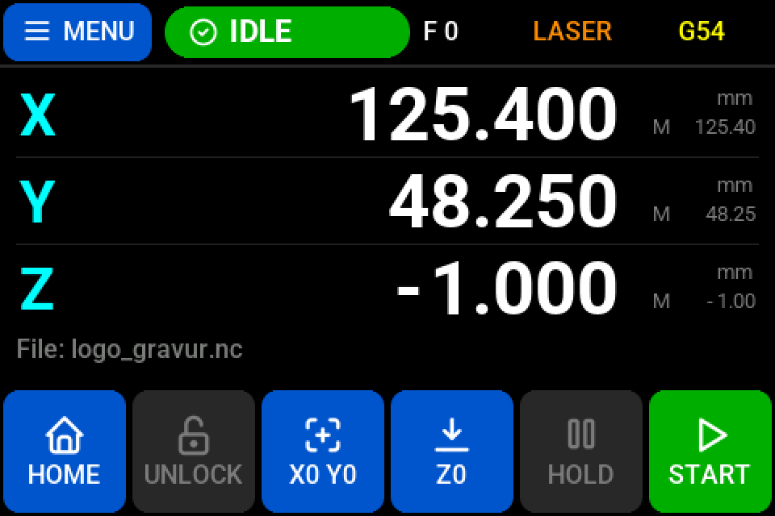
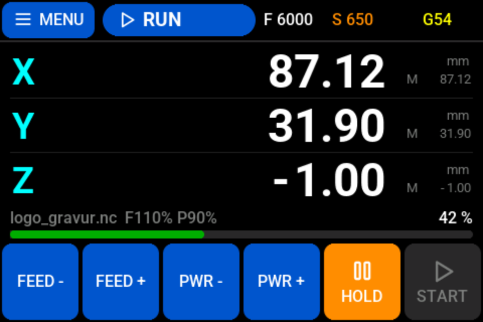
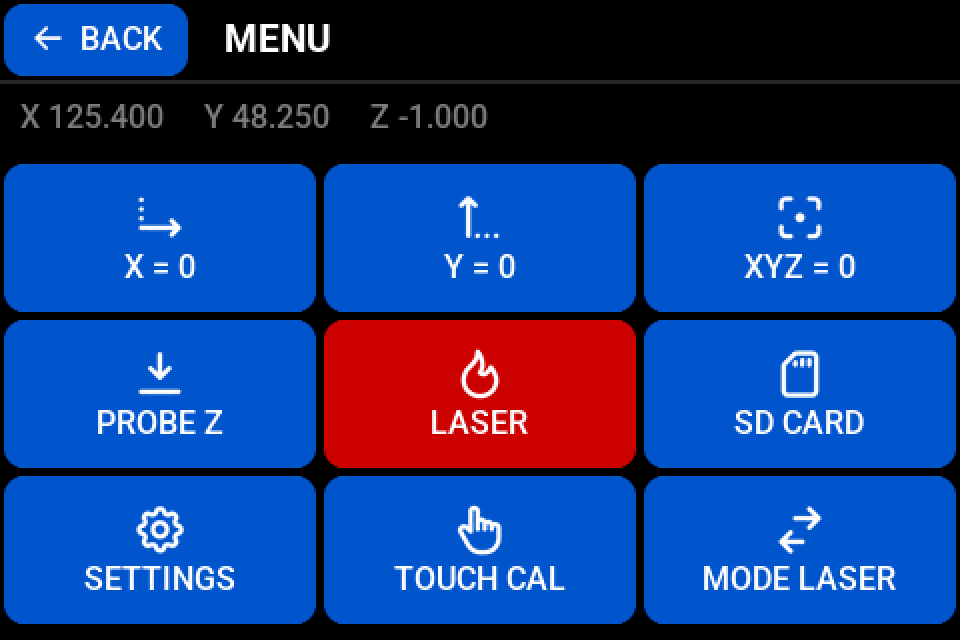

# grblHAL for BTT Octopus Pro v1.0 – custom CNC/laser machine

This is a fork of [grblHAL/STM32F4xx](https://github.com/grblHAL/STM32F4xx) with the configuration and extensions for one specific machine: a CNC router/laser built on a **BIGTREETECH Octopus Pro v1.0** (STM32F446ZE, 12 MHz crystal, BTT bootloader), previously running Marlin.

The working branch is **`octopus-pro-joy`** (default branch). `master` tracks upstream grblHAL unchanged.

## What is different from upstream grblHAL

### Own board map via `BOARD_MY_MACHINE`
- The pin map for this machine is in [`boards/my_machine_map.h`](boards/my_machine_map.h), enabled with `#define BOARD_MY_MACHINE` in [`Inc/my_machine.h`](Inc/my_machine.h).
- The original [`boards/btt_octopus_pro_map.h`](boards/btt_octopus_pro_map.h) (Octopus Pro v1.1) is **left untouched**, so upstream updates merge without conflicts.
- Pins differing from the v1.1 map were taken from the working Marlin configuration ([Steppge/Marlin-OctopusPro-CNC-Laser](https://github.com/Steppge/Marlin-OctopusPro-CNC-Laser), `BOARD_BTT_OCTOPUS_PRO_V1_0`) with modified motor slots:

| Axis | Driver slot | Note |
|---|---|---|
| X | MOTOR0 | |
| Y | MOTOR6 | ganged with Y2, auto-squared |
| Y2 (M3) | MOTOR7 | `Y_GANGED` + `Y_AUTO_SQUARE` |
| Z | MOTOR1 | |
| – | MOTOR2 | spare (M7), no driver fitted |

- Trinamic TMC2209 drivers via UART, onboard AT24C32 EEPROM, SD card with YModem upload over USB (`SDCARD_ENABLE 2`, e.g. with ioSender), USB CDC.
- Spindle/laser: PWM on FAN0 (PA8), enable on the bed output (PA1), direction on FAN5 (PD15). PWM frequency 4000 Hz (`DEFAULT_SPINDLE_PWM_FREQ` in `platformio.ini`).
- Controls: reset (TB, PF3) and feed hold (T0, PF4), probe on Z2-STOP (PG11).

### Startup fix in `Src/main.c`
The BTT bootloader leaves the system clock running from the PLL. Upstream only switched back to HSI before the PLL setup for `BOARD_BTT_OCTOPUS_PRO`, so any other board define (e.g. `BOARD_MY_MACHINE`) hung at startup without USB. The switch now depends on the actual clock source instead of the board define. Submitted upstream as [grblHAL/STM32F4xx#307](https://github.com/grblHAL/STM32F4xx/pull/307).

### Analog joystick jogging – [`Src/joystick_plugin.c`](Src/joystick_plugin.c)
- Three analog sticks on TH1/TH2/TH3 (PF5/PF6/PF7) for X/Y/Z, enable switch on Stop7 (PG15).
- While the enable switch is active, stick deflection streams short `$J=` jog segments; releasing the stick cancels the jog.
- 10 speed steps per direction with hysteresis and smoothed readings. Step 1 has a fixed slow speed (5 mm/min X/Y, 2 mm/min Z) for touching off, steps 2-10 rise up to 35 % of the axis max rate (`$110`-`$112`).
- Safety: implausible readings (broken wire, short) disable the joystick; after power-up it stays locked until all sticks were centered once (start lock).
- Raw stick values and the enable level are appended to the status report (`|Joy:x,y,z,en`) for calibration.
- Stick calibration and speeds are set at the top of the file.

### Controller fan – [`Src/controller_fan.c`](Src/controller_fan.c)
- The stepper driver fan on FAN2 runs while the drivers are enabled, like Marlin's `USE_CONTROLLER_FAN`.
- `$1=60000`: after the last move the drivers stay enabled for 60 s with the hold current (`$210`-`$212`), then drivers and fan switch off.

### Touch display – [`Src/tft_display.c`](Src/tft_display.c)
MKS TS35-R V2.0 (ST7796 480x320, XPT2046 touch) on EXP1/EXP2:
- Main screen with state, work/machine position, SD job progress, feed rate and WCS; buttons for menu, home, unlock, zeroing, hold and start. The start button shows LOAD while no file is selected. The unlock button shows RESET while a hard limit alarm waits for a reset and is greyed out while a limit switch is engaged (strict mode). With homing required after power-up (`$22=591`) it shows HOLD 3S: holding it unlocks without homing (no soft limits then).
- Short alarm names in the status field and override buttons while a job runs, see the tables below.
- Menu with zeroing, Z probing (sets Z0 with plate thickness), laser test pulse, SD card file list, settings, machine mode and a Move screen.
- Move screen: jog X/Y/Z by tapping, step 0.01 / 0.05 / 0.1 / 1 / 10 mm per tap.
- Touch calibration: hold the status bar on the main screen for 3 seconds while idle.
- Buttons that move the machine or fire the laser must be held (long press).
- Anti-aliased fonts and icons, drawn in small steps so the controller is never blocked.

**Alarm names in the status field**

| Alarm | Shown | Meaning |
|---|---|---|
| 1 | `HARD LIM` | Hard limit switch triggered |
| 2 | `SOFT LIM` | Target outside the work area (soft limits) |
| 3 | `ABORTED` | Reset while moving, position lost |
| 4, 5 | `PROBE ERR` | Probing failed |
| 6, 7, 8, 9 | `HOME FAIL` | Homing failed |
| 10 | `E-STOP` | Emergency stop |
| 11 | `NO HOME` | Homing required after power-up |
| 12 | `LIMIT ON` | A limit switch is still engaged (strict mode `$21=3`) |
| other | `ALARM:nn` | Alarm number |

**Buttons while a job runs**

| Button | Tap | Hold |
|---|---|---|
| `FEED -` / `FEED +` | Feed override -/+ 10 % | Feed override back to 100 % |
| `PWR -` / `PWR +` | Laser power / spindle speed override -/+ 10 % | Override back to 100 % |
| `HOLD` | Feed hold, at once | – |
| `STOP` (after HOLD) | – | Abort the job (reset, laser off, position kept) |
| `RESUME` (after HOLD) | Continue the job | – |

Overrides other than 100 % are shown at the end of the info line, e.g. `logo.nc  F110% P90%`. While a job runs the values on the display are refreshed every 500 ms, the touch screen is still polled every 20 ms.

| Main screen (idle) | Main screen (job running) | Menu |
|---|---|---|
|  |  |  |

*Rendered previews: PC simulation of the display drawing code with the firmware's font data and example values, shown at 2x size.*

## Build and flash
1. Install VS Code with the PlatformIO extension.
2. Clone **with submodules** ("Download ZIP" on GitHub does not include them, the build fails):
   ```
   git clone --recursive -b octopus-pro-joy https://github.com/Steppge/grblHAL-OctopusPro-CNC-Laser.git
   ```
3. Select the board in [`Inc/my_machine.h`](Inc/my_machine.h), enable **only one** of them:
   - `#define BOARD_MY_MACHINE` – pin map [`boards/my_machine_map.h`](boards/my_machine_map.h) (this machine's wiring, active by default)
   - `#define BOARD_BTT_OCTOPUS_PRO` – original grblHAL pin map for the Octopus Pro (v1.1)

   Also check the other options in `my_machine.h` (motor currents, ganged Y axis, laser, ...). If you don't have the joystick, display and controller fan, remove `-D ADD_MY_PLUGIN=1` from the `octopus_pro_f446` environment in `platformio.ini`.
4. Build the environment **`octopus_pro_f446`** (linker script `STM32F446ZETX_BL32K_NONVS_FLASH.ld`, 32K bootloader offset).
5. Copy `.pio/build/octopus_pro_f446/firmware.bin` as `firmware.bin` to the SD card and power up the board.
   Or over USB (machine idle, no sender connected, needs `SDCARD_ENABLE 2` and pyserial): `python tools/upload_firmware.py --reboot` uploads the file to the SD card in the board with YModem and reboots, the bootloader then flashes it.

## Troubleshooting: grblHAL on the BTT Octopus Pro

Problems hit while moving this machine from Marlin to grblHAL, with the solutions. Maybe it saves someone else the search.

**No USB / board seems dead after flashing a build with `BOARD_MY_MACHINE` (or a custom board map)**
- The BTT bootloader leaves the system clock running from the PLL. Upstream grblHAL only switches back to HSI before the PLL setup when `BOARD_BTT_OCTOPUS_PRO` is defined. With any other board define `HAL_RCC_OscConfig()` fails, the firmware ends in `Error_Handler()` and hangs before USB comes up.
- Fix: the change in `Src/main.c` from this repository, submitted upstream as [grblHAL/STM32F4xx#307](https://github.com/grblHAL/STM32F4xx/pull/307).
- Workaround without the fix: keep `BOARD_BTT_OCTOPUS_PRO` and put your pins into `boards/btt_octopus_pro_map.h`.

**`my_machine_map.h` only works after renaming it to `btt_octopus_pro_map.h`**
- Same cause as above, the file name itself does not matter.

**Custom map is silently ignored**
- `Inc/driver.h` checks `BOARD_BTT_OCTOPUS_PRO` before `BOARD_MY_MACHINE`. If both are defined in `Inc/my_machine.h`, the original BTT map is used. Enable only one board.

**Octopus Pro v1.0 instead of v1.1**
- The upstream map is for v1.1. Some pins differ on v1.0 (e.g. MOTOR3 enable on PA0, HE0 on PA2, HE2 on PB10, RGB on PB0). The working Marlin configuration (`BOARD_BTT_OCTOPUS_PRO_V1_0`) is a good reference, see the comments in [`boards/my_machine_map.h`](boards/my_machine_map.h).

**Axis drives through an engaged limit switch into the mechanical stop**
- Hard limits only trigger on the change from released to engaged. A sender like LightBurn sends a reset right after `ALARM:1`; when the machine was standing still the position is not lost and grblHAL returns to Idle while the switch is still engaged. The next move towards the switch then gets no new trigger.
- Fix: `$21=3` (hard limits + strict mode). With a limit switch engaged after a reset grblHAL raises `ALARM:12`, refuses `$X` and only allows homing. Soft limits (`$20=1`) protect both ends once the machine is homed.

**Board does not start after flashing from SD card**
- The firmware must be linked for the 32K bootloader offset. Use the PlatformIO environment `octopus_pro_f446` (`STM32F446ZETX_BL32K_NONVS_FLASH.ld`, `HAS_BOOTLOADER=1`, `HSE_VALUE=12000000`) and copy the file as `firmware.bin` to the SD card.

## Credits & license

Based on [grblHAL](https://github.com/grblHAL) by Terje Io and contributors – driver [grblHAL/STM32F4xx](https://github.com/grblHAL/STM32F4xx), core [grblHAL/core](https://github.com/grblHAL/core), documentation in the [grblHAL wiki](https://github.com/grblHAL/core/wiki). grblHAL is in turn based on [Grbl](https://github.com/gnea/grbl) by Sungeun K. Jeon and Simen Svale Skogsrud.

Licensed under the GNU General Public License v3 or later, see [COPYING](COPYING). The copyright notices in the source files apply.
